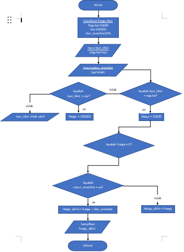
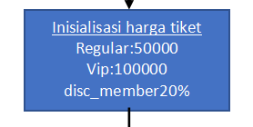
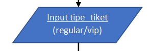
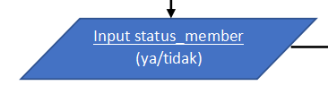
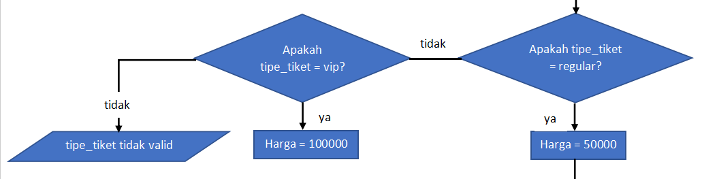
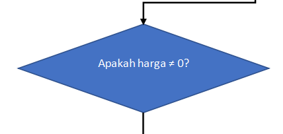
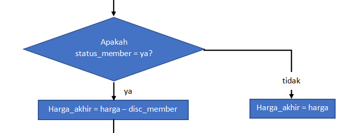
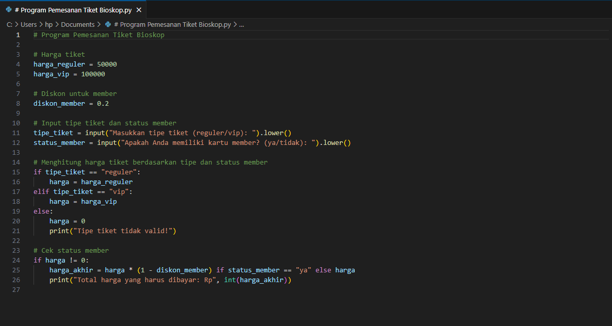
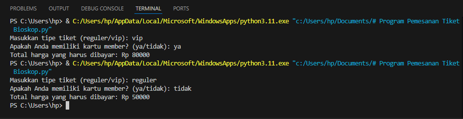

# labpy02
Nama        : Sayyid Sulthan Abyan 

Kelas       : TI.24.A.5 

Nim         : 312410496 

Mata kuliah : Bahasa Pemrograman 

## Program pemesanan tiket bioskop
### Flowchart

### Berikut adalah penjelasan terkait flowchart di atas 

- **Mulai:** Proses dimulai dengan langkah ini, ditandai oleh simbol oval. 

- **Inisialisasi Harga Tiket:** 

Tiket Reguler: Rp50.000 

Tiket VIP: Rp100.000 

Diskon Member: 20% 

Tentukan harga untuk tiket reguler dan tiket VIP, serta diskon yang diberikan untuk member 

- **Input Tipe Tiket:** Pengguna diminta untuk memasukkan tipe tiket yang ingin dibeli, apakah "reguler" atau "VIP". 

- **Input Status Member:** Pengguna diminta untuk memasukkan status keanggotaan mereka, apakah memiliki kartu member ("ya") atau tidak ("tidak"). 

- **Validasi Tipe Tiket:** Program memeriksa apakah tipe tiket yang diinput adalah "reguler" atau "VIP": 

Jika tipe tiket adalah "reguler", lanjutkan ke langkah berikutnya dengan harga tiket diatur ke Rp50.000. 

Jika tipe tiket adalah "VIP", lanjutkan ke langkah berikutnya dengan harga tiket diatur ke Rp100.000. 

Jika tipe tiket bukan "reguler" atau "VIP", anggap sebagai input yang tidak valid dan minta pengguna untuk memasukkan tipe tiket yang benar. 

- **Periksa Apakah Harga Tidak Nol:** 

Program memeriksa apakah harga tiket sudah diatur (tidak nol): 

Jika harga sudah diatur, lanjutkan ke langkah berikutnya. 

Jika harga belum diatur (nol), kembali ke input tipe tiket. 

- **Cek Status Member dan Hitung Diskon:** 

Program memeriksa apakah pengguna memiliki kartu member: 

Jika pengguna memiliki kartu member ("ya"), harga akhir dihitung dengan memberikan diskon 20%. 

Jika pengguna tidak memiliki kartu member ("tidak"), harga akhir tetap sama dengan harga tiket tanpa diskon. 

- **Tampilkan Harga Akhir:** Program menampilkan total harga tiket yang harus dibayar oleh pengguna. 

- **Selesai:** Proses selesai, ditandai oleh simbol oval. 

### Program python
seperti ini jika algoritma di atas yang di buat dalam bentuk flowchart di jadikan sebuah program dengan bahasa python

### Hasil eksekusi 
ini hasil eksekusi dari kode program di atas

## Membuat kalkulator sederhana
### Flowchart

**penjelasan unutk flowchart di atas**
- **Mulai:** Awal proses.
- **Input Angka Pertama:** Meminta pengguna memasukkan angka pertama.
- **Input Angka Kedua:** Meminta pengguna memasukkan angka kedua.
- **Input Operator Aritmatika:** Meminta pengguna memasukkan operator aritmatika (penjumlahan, pengurangan, perkalian, atau pembagian).
- **Pilih Operator Aritmatika:**
Jika operator adalah +, lakukan penjumlahan.
Jika operator adalah -, lakukan pengurangan.
Jika operator adalah *, lakukan perkalian.
Jika operator adalah /, lakukan pembagian (dengan pengecekan pembagian nol).
Jika operator tidak valid, tampilkan pesan kesalahan.
- **Hitung Hasil:** Hitung hasil operasi aritmatika berdasarkan operator yang dipilih.
- **Tampilkan Hasil:** Tampilkan hasil perhitungan kepada pengguna.
- **Selesai:** Akhir proses.
